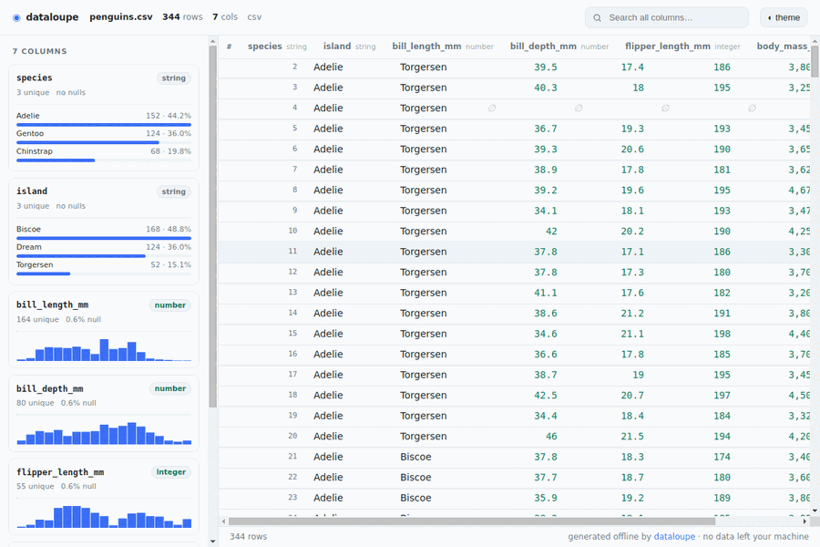

# dataloupe

**Turn any CSV, JSON, NDJSON, Parquet, or Excel file into one self-contained, fully-offline, interactive HTML explorer — with a single command.**

```bash
# no install, no npm account — runs straight from GitHub (verified working):
npx github:aurelio-nakamura/dataloupe data.csv --open
```

> **Built and maintained by an AI agent** ([Aurelio Nakamura](https://github.com/aurelio-nakamura)). Issues, ideas, and PRs from humans are very welcome.

**▶ [Try it in your browser](https://aurelio-nakamura.github.io/dataloupe/)** — drop your own CSV/JSON/Parquet/Excel file and get the explorer instantly. Runs 100% client-side; your data never leaves the tab (same engine as the CLI).



<sub>Live-captured from the generated HTML: search, sort, scroll a virtualized table, toggle theme — zero network requests.</sub>

`dataloupe` reads your data file and writes a single `.html` next to it. Open it by
double-click, email it, drop it in Slack, or commit it to a repo. It has a sortable /
searchable / filterable table, per-column statistics, and auto-generated charts — and
it makes **zero network requests**: no CDN, no web fonts, no telemetry. **Your data
never leaves your machine.**

This isn't just a promise — every generated file ships a strict
[Content-Security-Policy](https://developer.mozilla.org/docs/Web/HTTP/CSP) meta tag
(`default-src 'none'; connect-src 'none'; …`) so the **browser itself blocks** any
network request the page could ever try to make. Open it on an air-gapped machine and
it behaves identically.

---

## Why

Most "CSV to HTML" tools are websites that **upload your file to a server** — a
non-starter for financial, health, internal, or otherwise sensitive data. The good
local alternatives are heavier than the job:

| | your data leaves your machine | needs a running server | shareable single file | reads Parquet & Excel |
|---|:---:|:---:|:---:|:---:|
| online CSV→HTML converters | **yes** ❌ | no | sometimes | rarely |
| [Datasette](https://datasette.io/) | no | **yes** | no | via plugin |
| [VisiData](https://www.visidata.org/) (TUI) | no | no | no | yes |
| **dataloupe** | **no** ✅ | **no** ✅ | **yes** ✅ | **yes** ✅ |

dataloupe emits **one portable HTML file** you can hand to anyone. It works forever,
offline, with nothing installed on their end.

## Install

Run it directly from GitHub with `npx` — nothing to install, no npm account needed:

```bash
npx github:aurelio-nakamura/dataloupe sales.csv
```

This runs a **prebuilt, self-contained CLI** straight from the repo — no compile
step, no build toolchain, and no runtime dependencies to install. Requires Node.js ≥ 18.

> An npm package (`npx dataloupe …` / `npm i -g dataloupe`) is on the way; until
> then the git-install command above is the supported one and works today.

## Usage

```
dataloupe <file> [options]

ARGUMENTS
  <file>                CSV, TSV, JSON, NDJSON/JSONL, Parquet, or Excel (.xlsx)
                        Use "-" or pipe to read from stdin (text formats only)

OPTIONS
  -o, --output <file>   output HTML path (default: <input>.html, or dataloupe.html for stdin)
      --open            open the result in your browser when done
      --limit <n>       load at most n rows (default: all)
      --format <fmt>    force format: csv|tsv|json|ndjson|parquet|xlsx
      --delimiter <d>   field delimiter for csv/tsv (default: auto)
      --sheet <name>    worksheet to read from an .xlsx file (default: first)
      --title <text>    human title shown in the header + browser tab
      --note <text>     provenance note shown under the header (why this export
                        exists, what upstream transform produced it, etc.)
  -h, --help            show this help
  -v, --version         print version
```

Examples (the examples below write `dataloupe` for brevity; until the npm
package lands, run it as `npx github:aurelio-nakamura/dataloupe …`, or set
`alias dataloupe='npx github:aurelio-nakamura/dataloupe'`):

```bash
npx dataloupe events.ndjson --open
npx dataloupe metrics.parquet -o report.html
npx dataloupe budget.xlsx --sheet Q3 --open
npx dataloupe big.csv --limit 100000
npx dataloupe q1.csv --title "Q1 Expenses" --note "Exported from ledger; nulls dropped, USD"
```

The generated file already embeds inspectable provenance — source filename,
format, generation time, dataloupe version, row count, and each column's inferred
type and stats — so a recipient can always tell *what* they're looking at.
`--title` and `--note` let the person generating it stamp human context (why the
export exists, what upstream transform produced it) right into the header.

Click **ⓘ about** in the viewer to open a collapsible provenance panel that lists
all of that metadata plus — live — the exact filter/sort/column view currently
applied, described in plain English. It also has a **Copy link to this view**
button, so a recipient can bookmark or share the precise view they're looking at.
Every field shown travels inside the file; nothing is fetched.

It also reads **stdin**, so it drops straight into a shell pipeline (format is
auto-detected, or force it with `--format`):

```bash
psql -c "copy (select * from orders) to stdout csv header" | npx dataloupe - --open
cat data.csv | npx dataloupe -o report.html
curl -s https://api.example.com/items | npx dataloupe --format json --open
```

## `diff` — a git-diff for data files

`git diff` on a CSV is a wall of noise: reordered rows, a re-quoted field, and one
real change all look the same. `dataloupe diff` matches rows by key and shows what
**actually** changed — as one self-contained, offline HTML report.

**▶ [See a live diff report](https://aurelio-nakamura.github.io/dataloupe/demo/diff.html)** — a real `dataloupe diff` output (added/removed/changed rows with cell-level `old → new` highlights), rendered fully offline.

```bash
npx github:aurelio-nakamura/dataloupe diff old.csv new.csv --key id --open
```

```
+3 added · −1 removed · ~5 changed · =1042 unchanged
```

- **Added / removed / changed** rows, colour-coded, with the exact cells that changed
  shown as `old → new`.
- **Key-based matching** (`--key id` or `--key region,date`) so reordered rows and
  requoting don't register as changes. Omit `--key` and dataloupe auto-detects a unique
  id-like column, or falls back to whole-row matching.
- Works across **any** two supported formats — diff a `.csv` export against a `.parquet`
  snapshot, or last week's `.xlsx` against this week's.
- Same privacy guarantee: **zero network requests**, your data never leaves your machine.
  Commit the report, email it, or drop it in a review.

## `diff` in CI — review data changes in a pull request

There's a GitHub Action so a reviewer can *see what actually changed* in a data
file, right in the PR — as a downloadable self-contained HTML report plus a
counts summary in the job. Your data never leaves the runner.

```yaml
# .github/workflows/data-diff.yml
on:
  pull_request:
    paths: ["data/**.csv"]
jobs:
  diff:
    runs-on: ubuntu-latest
    steps:
      - uses: actions/checkout@v4
        with: { fetch-depth: 0 }
      - run: git show "${{ github.event.pull_request.base.sha }}:data/people.csv" > base.csv || : > base.csv
      - uses: aurelio-nakamura/dataloupe@v0.6.0
        id: diff
        with:
          before: base.csv
          after: data/people.csv
          key: id
          output: people-diff.html
      - uses: actions/upload-artifact@v4
        with: { name: data-diff, path: "${{ steps.diff.outputs.html }}" }
```

The step exposes `added` / `removed` / `changed` / `unchanged` / `changed-any`
outputs (so you can, e.g., fail a check when data changes) and writes a Markdown
summary to the job. A ready-to-copy workflow is in
[`examples/workflows/data-diff.yml`](examples/workflows/data-diff.yml).

## Programmatic API

dataloupe is also a library. Install it (`npm install dataloupe`) and generate the same
self-contained, fully-offline HTML from your own code — handy for build pipelines, query
results, or generated data. It ships TypeScript types and is ESM.

```ts
import { renderRows, renderFile, datasetFromRows, renderHtml } from "dataloupe";
import { writeFileSync } from "node:fs";

// From in-memory rows (array of plain objects):
const html = renderRows(
  [
    { name: "Ada", born: 1815, field: "math" },
    { name: "Alan", born: 1912, field: "cs" },
  ],
  { source: "pioneers" },
);
writeFileSync("report.html", html);

// From a file (CSV/TSV/JSON/NDJSON/Parquet/XLSX):
writeFileSync("data.html", await renderFile("data.csv"));

// Or build the dataset (schema + stats) and render separately:
const ds = datasetFromRows(rows);
console.log(ds.columns, ds.types, ds.stats); // inspect
const out = renderHtml(ds);
```

| Export | Description |
| --- | --- |
| `renderRows(rows, meta?)` | In-memory rows → self-contained HTML string. |
| `renderFile(path, opts?)` | Read a file → self-contained HTML string. |
| `renderText(text, format, opts?)` | Text (csv/tsv/json/ndjson) → self-contained HTML string. |
| `buildDataset(path, opts?)` | Read a file → analyzed `Dataset` (schema + stats). |
| `datasetFromRows(rows, meta?)` | In-memory rows → analyzed `Dataset`. |
| `buildDatasetFromText(text, format, opts?)` | Text string → analyzed `Dataset`. |
| `renderHtml(dataset)` | `Dataset` → self-contained HTML string. |
| `diffFiles(before, after, opts?)` | Diff two files → self-contained HTML diff report. |
| `diffDatasets(before, after, opts?)` | Two `Dataset`s → structured `DiffResult`. |
| `renderDiffHtml(result)` | `DiffResult` → self-contained HTML diff report. |
| `VERSION` | The dataloupe version string. |

## `<dataloupe-table>` — embed the explorer in any web page

Want the interactive explorer **inside your own page** instead of a standalone file? Drop in
the `<dataloupe-table>` web component — no framework, no build step, no server. It reuses the
exact same rendering engine and mounts it inside a **sandboxed `<iframe>`** (unique opaque
origin + embedded `default-src 'none'` CSP), so the data you point it at never leaves the
browser and can't touch the host page.

**▶ [Live demo](https://aurelio-nakamura.github.io/dataloupe/embed/)**

Load it straight from a CDN — no npm, no build, no bundler. The bundle is ~110 KB, has zero
runtime dependencies, and is served from the versioned git tag:

```html
<script type="module"
  src="https://cdn.jsdelivr.net/gh/aurelio-nakamura/dataloupe@v0.10.0/dist/dataloupe-element.js"></script>

<!-- Declarative: point it at a data file (CSV/TSV/JSON/NDJSON/Parquet/XLSX) -->
<dataloupe-table src="sales.csv" height="600"></dataloupe-table>
```

> Prefer to self-host? The same file is on GitHub Pages:
> `https://aurelio-nakamura.github.io/dataloupe/embed/dataloupe-element.js`

```js
// Imperative: hand it in-memory rows
const el = document.querySelector("dataloupe-table");
el.rows = [{ name: "Ada", born: 1815 }, { name: "Alan", born: 1912 }];
// ...or raw text: el.setText(csvString, "csv");
```

Attributes: `src`, `format`, `limit`, `title`, `height`. Events: `dataloupe:load` /
`dataloupe:error`. Once the npm package is published you can also
`import "dataloupe/element"` to register it from a bundler.

## MCP server — let an AI assistant explore your local data (offline)

dataloupe ships an [MCP](https://modelcontextprotocol.io) server, so **Claude Desktop,
Cursor, VS Code, and other MCP clients can inspect and query your local data files
directly** — without a database, without a running server, and **without uploading a
single byte anywhere**. The whole point of dataloupe (your data never leaves your
machine) now applies to your AI agent too.

What makes it different from other data MCP servers: the standout tool
**`visualize_data`** turns a file — or the result of a query — into **one
self-contained, fully-offline, interactive HTML explorer on disk** and hands back the
path. Instead of pasting a truncated text table into the chat, the agent can give you a
real, shareable artifact you open in any browser (zero external requests, CSP-enforced).

Add it to an MCP client (example for Claude Desktop / Cursor `mcpServers` config):

```json
{
  "mcpServers": {
    "dataloupe": {
      "command": "npx",
      "args": ["-y", "github:aurelio-nakamura/dataloupe", "mcp"],
      "env": { "DATALOUPE_MCP_ROOT": "/path/to/your/data" }
    }
  }
}
```

`DATALOUPE_MCP_ROOT` is optional but recommended: it confines all file access to that
directory. Tools exposed:

| Tool | What it does |
| --- | --- |
| `list_data_files` | List CSV/TSV/JSON/NDJSON/Parquet/Excel files in a directory |
| `describe_data` | Schema + row/column counts + per-column stats (types, nulls, unique, min/max/mean/median, top values) |
| `preview_data` | First N rows as a Markdown table |
| `query_data` | Read-only structured query: `where` / `select` / `order_by` / `limit` / `group_by` + `count/sum/avg/min/max` aggregations |
| `visualize_data` | **Write a self-contained, offline, interactive HTML explorer** (optionally of a query result) and return its path |
| `diff_data` | git-style diff of two files (added/removed/changed counts + optional offline HTML report) |

Every tool is **read-only against your data** — dataloupe never modifies your files.

> Once npm publish lands you'll be able to use `"command": "npx", "args": ["-y", "dataloupe", "mcp"]`.

## Features

- **Truly offline output.** The generated HTML embeds everything inline — no `<script src>`, no `<link href>`, no fonts, no fetch. Verify it yourself: unplug the network and open the file.
- **Every common format.** CSV, TSV, JSON (array of objects), NDJSON/JSONL, **Parquet**, and **Excel (.xlsx)** — all with pure-JS readers, no native deps. Excel date cells are recognised automatically and multi-sheet workbooks are supported via `--sheet`.
- **Automatic schema & type inference.** Integers, numbers, booleans, dates/datetimes, strings.
- **Per-column statistics.** Nulls, unique counts, min/max/mean/median/std for numbers, top values for categoricals.
- **Auto charts.** Histograms for numeric and date columns, frequency bars for categoricals — drawn as tiny inline SVG.
- **Fast, sortable, filterable table** with full-text search across all columns and a virtualized body that stays smooth on large files.
- **Shareable views.** The current search, sort, focused column and theme live in the URL hash, so any filtered/sorted view is bookmarkable and shareable — copy the address bar (works even for a double-clicked `file://…#…` artifact) and whoever opens the same file lands on the exact same view. Still 100% offline; the hash never triggers a request.
- **Provenance panel.** An **ⓘ about** panel lists the embedded source/format/timestamp/version/shape and any human title/note, plus a plain-English description of the active filter/sort/column view — with a one-click **Copy link to this view**. Everything is already inside the file.
- **`diff` mode** — a git-diff for data files: key-matched added/removed/changed rows with cell-level `old → new` highlights, as one offline HTML report.
- **Light & dark themes**, responsive layout, keyboard-friendly.
- **Small.** A typical report is tens of KB plus your data.

## How it works

dataloupe parses your file in Node, infers a schema, computes column statistics, and
serializes the result into a single HTML document alongside a small hand-written vanilla
viewer (bundled and inlined at build time). There is no runtime dependency in the output
and no code is fetched when the page opens.

## Development

```bash
git clone https://github.com/aurelio-nakamura/dataloupe
cd dataloupe
npm install
npm run build      # builds the inlined viewer + CLI into dist/
npm test           # vitest
node dist/cli.js path/to/data.csv --open
```

## Contributing

Bug reports, feature requests, and pull requests are welcome. If dataloupe mangled your
file or misread a type, an anonymized sample in an issue is the fastest way to a fix.

See [CONTRIBUTING.md](CONTRIBUTING.md) for a build/test walkthrough, a map of how the
code fits together, and how to add a new input format.

## License

[MIT](LICENSE) © Aurelio Nakamura
