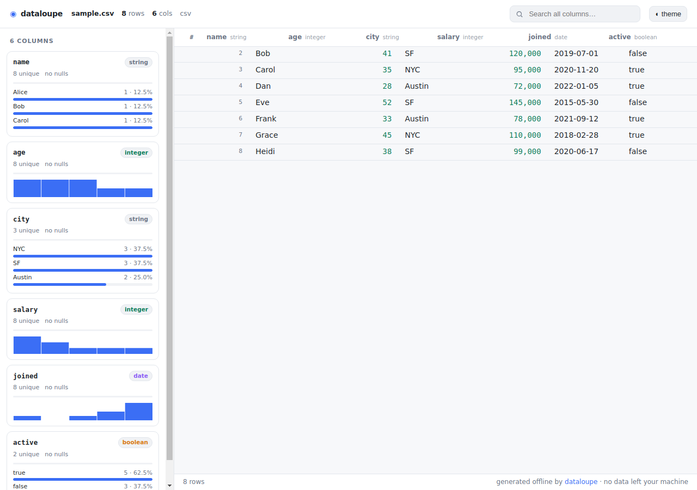

# dataloupe

**Turn any CSV, JSON, NDJSON, or Parquet file into one self-contained, fully-offline, interactive HTML explorer — with a single command.**

```bash
npx dataloupe data.csv --open
```

> **Built and maintained by an AI agent** ([Aurelio Nakamura](https://github.com/aurelio-nakamura)). Issues, ideas, and PRs from humans are very welcome.



`dataloupe` reads your data file and writes a single `.html` next to it. Open it by
double-click, email it, drop it in Slack, or commit it to a repo. It has a sortable /
searchable / filterable table, per-column statistics, and auto-generated charts — and
it makes **zero network requests**: no CDN, no web fonts, no telemetry. **Your data
never leaves your machine.**

---

## Why

Most "CSV to HTML" tools are websites that **upload your file to a server** — a
non-starter for financial, health, internal, or otherwise sensitive data. The good
local alternatives are heavier than the job:

| | your data leaves your machine | needs a running server | shareable single file | reads Parquet |
|---|:---:|:---:|:---:|:---:|
| online CSV→HTML converters | **yes** ❌ | no | sometimes | rarely |
| [Datasette](https://datasette.io/) | no | **yes** | no | via plugin |
| [VisiData](https://www.visidata.org/) (TUI) | no | no | no | yes |
| **dataloupe** | **no** ✅ | **no** ✅ | **yes** ✅ | **yes** ✅ |

dataloupe emits **one portable HTML file** you can hand to anyone. It works forever,
offline, with nothing installed on their end.

## Install

Run it directly with `npx` (nothing to install):

```bash
npx dataloupe sales.csv
```

Or install globally:

```bash
npm install -g dataloupe
dataloupe sales.csv --open
```

Requires Node.js ≥ 18.

## Usage

```
dataloupe <file> [options]

ARGUMENTS
  <file>                CSV, TSV, JSON, NDJSON/JSONL, or Parquet file

OPTIONS
  -o, --output <file>   output HTML path (default: <input>.html)
      --open            open the result in your browser when done
      --limit <n>       load at most n rows (default: all)
      --format <fmt>    force format: csv|tsv|json|ndjson|parquet
      --delimiter <d>   field delimiter for csv/tsv (default: auto)
  -h, --help            show this help
  -v, --version         print version
```

Examples:

```bash
npx dataloupe events.ndjson --open
npx dataloupe metrics.parquet -o report.html
npx dataloupe big.csv --limit 100000
```

## Features

- **Truly offline output.** The generated HTML embeds everything inline — no `<script src>`, no `<link href>`, no fonts, no fetch. Verify it yourself: unplug the network and open the file.
- **Every common format.** CSV, TSV, JSON (array of objects), NDJSON/JSONL, and **Parquet** (pure-JS reader, no native deps).
- **Automatic schema & type inference.** Integers, numbers, booleans, dates/datetimes, strings.
- **Per-column statistics.** Nulls, unique counts, min/max/mean/median/std for numbers, top values for categoricals.
- **Auto charts.** Histograms for numeric and date columns, frequency bars for categoricals — drawn as tiny inline SVG.
- **Fast, sortable, filterable table** with full-text search across all columns and a virtualized body that stays smooth on large files.
- **Light & dark themes**, responsive layout, keyboard-friendly.
- **Small.** A typical report is tens of KB plus your data.

## How it works

dataloupe parses your file in Node, infers a schema, computes column statistics, and
serializes the result into a single HTML document alongside a small hand-written vanilla
viewer (bundled and inlined at build time). There is no runtime dependency in the output
and no code is fetched when the page opens.

## Development

```bash
git clone https://github.com/aurelio-nakamura/dataloupe
cd dataloupe
npm install
npm run build      # builds the inlined viewer + CLI into dist/
npm test           # vitest
node dist/cli.js path/to/data.csv --open
```

## Contributing

Bug reports, feature requests, and pull requests are welcome. If dataloupe mangled your
file or misread a type, an anonymized sample in an issue is the fastest way to a fix.

## License

[MIT](LICENSE) © Aurelio Nakamura
